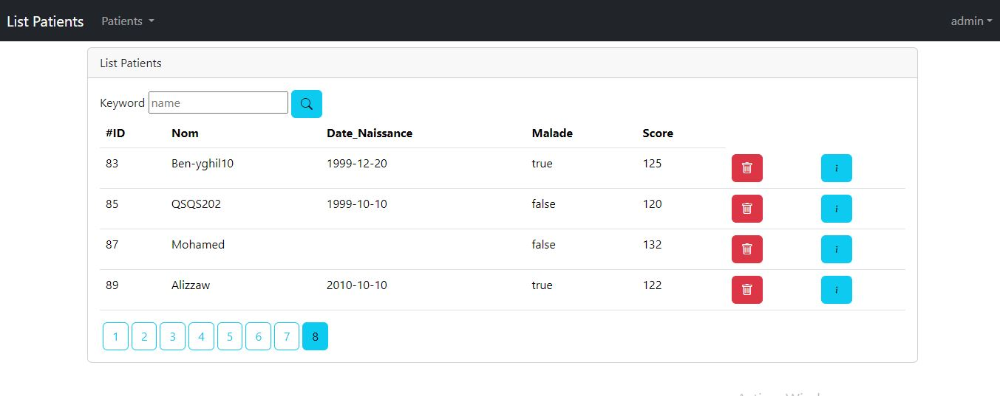
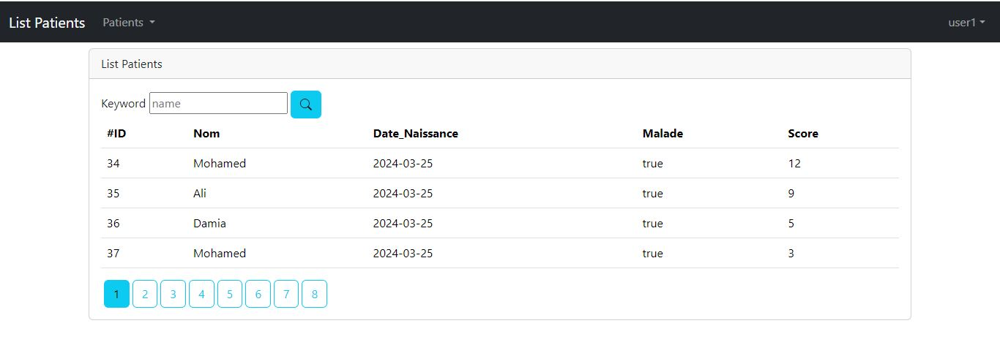

<h1>
    Activité Pratique N°3 - Spring MVC Thymeleaf Spring Security
</h1>

    <b>Partie 1:</b>  
    
Créer une application Web JEE basée sur Spring MVC, Thylemeaf et Spring Data JPA qui permet de gérer les patients. L'application doit permettre les fonctionnalités suivantes :

    <ul>
        <li>Afficher les patients</li>
        <li>Chercher les patients</li>
        <li>Supprimer un patient</li>
        <li>Faire des améliorations supplémentaires</li>
    </ul>

    <b>Partie 2:</b>  
    <ul>
        <li>Créer une page template</li>
        <li>Faire la validation des formulaires</li>
    </ul>

    <b>Partie 3:</b>  
    
Sécurité avec Spring security : 

    <ul>
        <li>InMemomy Authentication</li>
        <li>JDBC Authentication : </li>
        <li>UserDetails Service : </li>
    </ul>

 

<h3>Screen De l'application : </h3>
<b>Role Admin:</b>

 
<b>Role User:</b>

